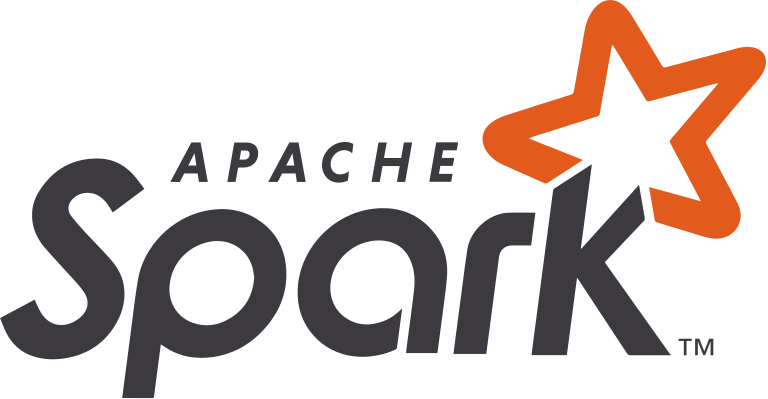

# Apache Spark with PySpark

**Welcome** to this **code-first** tutorial on **Apache Spark** for large-scale data processing. This site covers:

- **Theoretical** motivations behind Spark and big data processing.
- **Practical**, step-by-step instructions on setting up and using Spark.
- Hands-on examples using **PySpark** and popular Python libraries like pandas, numpy, scikit-learn, matplotlib, plotly, and statsmodels.

Start with the [Introduction](introduction.md) to learn about the historical context and why Spark is awesome!
